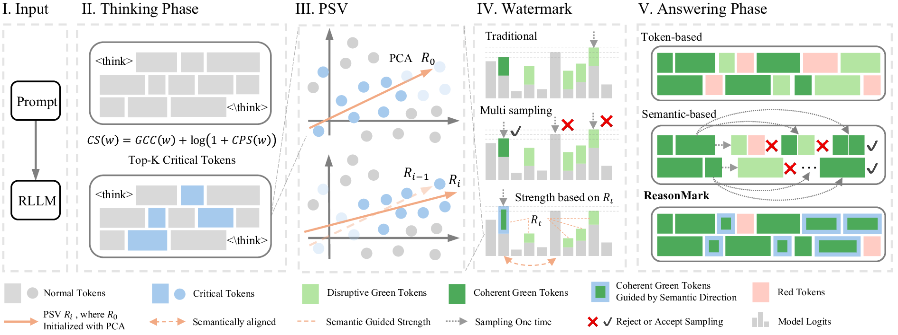

## DISTILLING THE THOUGHT, WATERMARKING THE ANSWER: A PRINCIPLE SEMANTIC GUIDED WATERMARK FOR LARGE REASONING MODELS

<div align="center">
Shuliang Liu<sup>1,2</sup>, Xingyu Li<sup>1</sup>, Hongyi Liu<sup>1</sup>, Yibo Yan<sup>1,2</sup>, Bingchen Duan<sup>1,2</sup>, Qi Zheng<sup>1,2</sup>, Dong Fang<sup>3*</sup>, Lingfeng Su<sup>3</sup>, Xuming Hu<sup>1,2*</sup>
</div>

<div align="center">
<sup>1</sup> The Hong Kong University of Science and Technology (Guangzhou) <br/>
<sup>2</sup> The Hong Kong University of Science and Technology <br/>
<sup>3</sup> Independent Researcher
</div>

<div align="center">
  <a href="https://arxiv.org/abs/2601.05144">
    
  </a>
</div>

## Abstract

Reasoning Large Language Models (RLLMs) excelling in complex tasks present unique challenges for digital watermarking, as existing methods often disrupt logical coherence or incur high computational costs. Token-based watermarking techniques can corrupt the reasoning flow by applying pseudo-random biases, while semantic-aware approaches improve quality but introduce significant latency or require auxiliary models. This paper introduces **ReasonMark**, a novel watermarking framework specifically designed for reasoning-intensive LLMs. Our approach decouples generation into an undisturbed **Thinking Phase** and a watermarked **Answering Phase**. We propose a **Criticality Score** to identify semantically pivotal tokens from the reasoning trace, which are distilled into a **Principal Semantic Vector (PSV)**. The PSV then guides a semantically-adaptive mechanism that modulates watermark strength based on token-PSV alignment, ensuring robustness without compromising logical integrity. Extensive experiments show ReasonMark surpasses state-of-the-art methods by reducing text Perplexity by 0.35, increasing translation BLEU score by 0.164, and raising mathematical accuracy by 0.67 points. These advancements are achieved alongside a 0.34% higher watermark detection AUC and stronger robustness to attacks, all with a negligible increase in latency. This work enables the traceable and trustworthy deployment of reasoning LLMs in real-world applications.

<div align="center">
  
</div>

---

## 🏗️ Project Structure

```
MarkLLM-dev/
├── config/                        # Algorithm configs (including config/OURS.json)
├── watermark/
│   └── ours/                      # OURS/ReasonMark implementation (watermark/ours/ours.py)
├── scripts/                       # Generation / visualization / quality / detectability
│   ├── generate_hf.sh
│   ├── visualize.sh
│   ├── assess_quality.sh
│   └── assess_detectability.sh
├── dataset/                       # Evaluation datasets (c4/gsm8k/wmt/human_eval/...)
├── outputs/                       # Generation and evaluation outputs (auto-created)
├── generate_hf.py                 # Main entry for generation (watermarked / unwatermarked)
├── assess_detectability.py        # Main entry for detectability evaluation
├── assess_quality.py              # Main entry for text quality evaluation
└── visualization.py               # Main entry for visualization
```

## 🚀 Quick Start

### Prerequisites
- Python **3.10**
- Dependencies: `torch`, `transformers`, `vllm`, `datasets`, etc. (see `requirements*.txt`)

### Installation

```bash
cd MarkLLM-dev

pip install -r requirements.txt
```

---


## 📊 How to Use (Step-by-step)

### 1) Generate (Watermarked / Unwatermarked)

```bash
# in MarkLLM-dev/

bash scripts/generate_hf.sh \
  --model-path "Qwen/Qwen3-32B" \
  --algorithm-name "OURS" \
  --dataset-name "c4" \
  --dataset-len 200 \
  --watermark-before-think
# For the OURS algorithm, add --watermark-before-think
```

Common arguments:

- `--max-model-len`
- `--max-new-tokens` / `--min-new-tokens`
- `--temperature` / `--top-p` / `--top-k` / `--min-p`
- `--watermark-before-think`: apply watermarking before `</think>` (for reasoning-model output format)

### 2) Assess Text Quality

```bash
# in MarkLLM-dev/

bash scripts/assess_quality.sh \
  --algorithm "OURS" \
  --model-path "Llama/Meta-Llama-3.1-70B-bnb-4bit" \
  --dataset-name "c4" \
  --dataset-len 200
```

### 3) Assess Detectability

```bash
# in MarkLLM-dev/

bash scripts/assess_detectability.sh \
  --algorithm "OURS" \
  --model-path "Qwen/Qwen3-32B" \
  --dataset-name "c4" \
  --dataset-len 200 
```


## 🧩 Algorithm Configuration (ReasonMark / OURS)

- Config file: `config/OURS.json`
- Implementation: `watermark/ours/ours.py`

---

## 📁 Dataset

Dataset/task configuration entry point is `cfg.py`. Common options include:
- `c4` (text continuation)
- `cnn_dailymail` (summarization)
- `wmt16_de_en` / `wmt19_zh_en` (machine translation)
- `human_eval` (code generation)
- `gsm8k` / `mmlu_pro` / `aime_2025` (reasoning / multiple choice / math)

---

## 📄 License

The core code in this repository (`MarkLLM-dev`) is licensed under **Apache-2.0** (see `MarkLLM-dev/LICENSE`).

---

## 📖 Citation
```bibtex
@article{liu2026distilling,
  title={Distilling the Thought, Watermarking the Answer: A Principle Semantic Guided Watermark for Large Reasoning Models},
  author={Liu, Shuliang and Li, Xingyu and Liu, Hongyi and Yan, Yibo and Duan, Bingchen and Zheng, Qi and Fang, Dong and Su, Lingfeng and Hu, Xuming},
  journal={arXiv preprint arXiv:2601.05144},
  year={2026}
}
```

## 📧 Contact

- Email: shulianglyo@gmail.com
